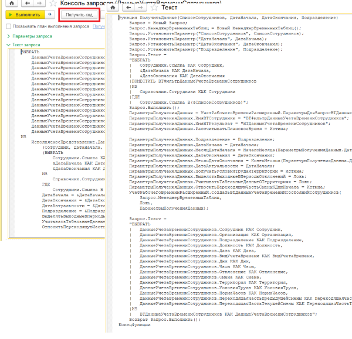
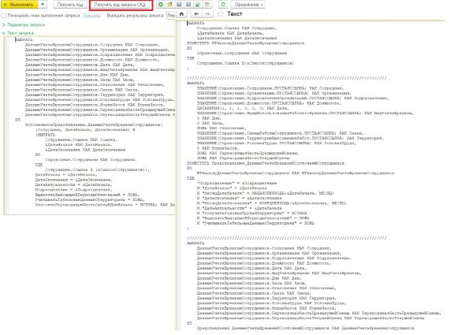
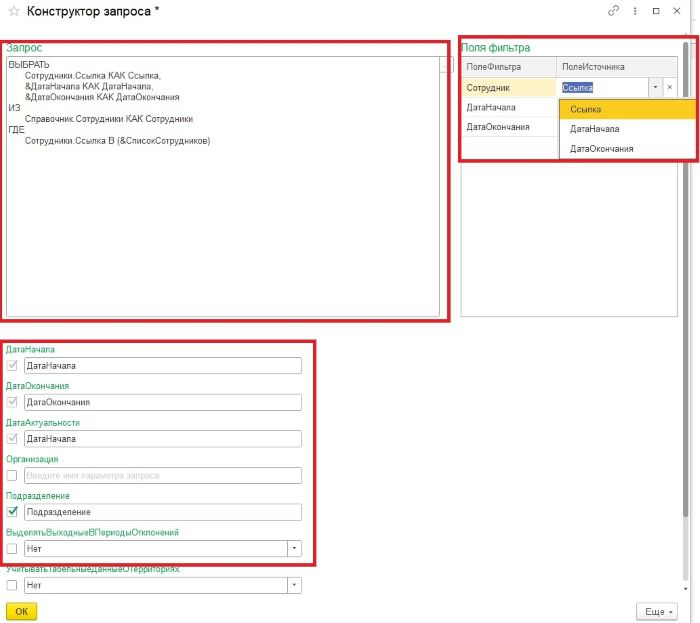
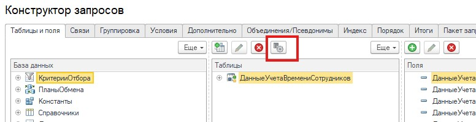

- [Ссылка на файл расширения](#ссылка-на-файл-расширения)
- [Статья](#статья)
- [Структура репозитория](#структура-репозитория)
- [Описание проекта](#описание-проекта)
- [Исполняемые представления](#исполняемые-представления)
- [Ключевые возможности](#ключевые-возможности)
- [Консоль запросов](#консоль-запросов)
- [Конструктор запросов](#конструктор-запросов)
- [Список поддерживаемых представлений](#доступные-исполняемые-представления)
- [Добавление пользовательских представлений](#добавление-собственных-исполняемых-представлений)

## Ссылка на файл расширения

https://github.com/pulh1/QueryConsole1C/releases/download/beta/QueryConsoleZUP-0.5.0.1.cfe

## Статья на 

https://infostart.ru/public/2388804/

## Структура репозитория

- `QueryConsoleZUP` — проект расширения в формате EDT
- `QueryExamples` — примеры запросов для консоли запросов
- `docs` — файлы документации
- `features` — feature-файлы с тестами для Vanessa Automation

##  Описание проекта

**QueryConsole1C** — это расширение, в состав которого входит консоль запросов для платформы **1С:Предприятие**, поддерживающая расширенную семантику языка запросов, включая поддержку нового типа источников данных — **ИсполняемыеПредставления**, которые являются аналогом виртуальных таблиц.

Использование этих источников позволяет обращаться к методам **программного интерфейса зарплатно-кадровой подсистемы типовых конфигураций** (ЗУП, ЗГУ, ERP) прямо внутри **пакетов запросов**, что открывает доступ к данным, формируемым внутренними алгоритмами зарплатно-кадровой функциональности, в виде временных таблиц.

Проект предназначен для разработчиков и консультантов, которым необходимо:

- Выполнять сложные запросы к данным ЗУП (ЗГУ, ERP) с учетом встроенной бизнес-логики;
- Интерактивно анализировать данные, используя временные таблицы, формируемые методами программного интерфейса зарплатнно-кадровых подсистем типовых конфигураций;
- Генерировать код на встроенном языке 1С с автоматическим преобразованием `ИсполняемыхПредставлений` в вызовы методов программного интерфейса;
- Упрощать построение запросов через визуальный **конструктор**, поддерживающий работу с расширениями языка запросов.

Консоль предоставляет гибкий инструмент анализа и отладки данных, недоступный в стандартной консоли запросов 1С, и значительно расширяет возможности разработчиков при интеграции, аудите и исследовании бизнес-логики типовых решений.

## Обзор архитектуры

В основе фреймворка лежит классическая многопроходная архитектура транслятора. Процесс обработки запроса разделен на последовательные этапы, каждый из которых выполняется независимым модулем.


---

1.  **Лексер и Парсер**
    Сначала текст запроса преобразуется в поток токенов (лексем). На основе этого потока работает **таблично-управляемый синтаксический анализатор**, который строит Абстрактное синтаксическое дерево (AST). Движок парсера является универсальным, а его логика (таблицы переходов) **автоматически генерируется** на основе формального описания грамматики языка в нотации, близкой к БНФ (форма Бэкуса-Наура).

2.  **Семантический анализатор**
    Обходит дерево AST, проверяя его на смысловую корректность: разрешает имена полей, выводит типы данных и валидирует использование конструкций языка.

3.  **Поставщик Представлений (Реестр)**
    Инфраструктурный компонент, отвечающий за обнаружение сервисов (**Service Discovery**). Он сканирует метаданные конфигурации (специализированные подсистемы) для автоматического поиска и каталогизации всех доступных в системе обработчиков представлений. Именно этот модуль предоставляет остальным компонентам метаописания представлений по их имени, обеспечивая слабую связанность и легкую расширяемость фреймворка.

4.  **Обработчик Исполняемых Представлений**
    Специализированный "плагин" для семантического анализатора. Перехватывает узлы AST, соответствующие обращениям к `ИсполняемоеПредставление.*`, запрашивает их метаописание у Поставщика, разбирает параметры и преобразует узел в специальный объект, готовый к выполнению.

5.  **Исполнитель**
    Финальный модуль и "мозг" системы, который, используя паттерн "Стратегия", определяет конечный результат (исполнение запроса или генерация кода). Ключевая особенность Исполнителя — встроенный **оптимизатор**. Он анализирует запрос к представлению и, если это возможно, делегирует (пробрасывает) операции напрямую обработчику представления:
    * **Фильтрацию (Predicate Pushdown):** условия из `ГДЕ` передаются внутрь представления.
    * **Выбор полей (Projection Pushdown):** запрашиваются только нужные колонки.

    Это позволяет в простых случаях избежать создания временных таблиц и выполнить запрос за один проход. Если же оптимизация невозможна (например, из-за `JOIN` или `GROUP BY`), Исполнитель прозрачно для пользователя материализует представление во временную таблицу и подменяет им узел в AST. Он также полностью управляет жизненным циклом всех создаваемых временных таблиц.


## Исполняемые представления

**Исполняемые представления** — это расширение языка запросов, добавленное в рамках данной консоли. Они являются **аналогом виртуальных таблиц**, но с более гибкой реализацией, ориентированной на работу с программным интерфейсом конфигураций 1С:Зарплата и управление персоналом 8 (ЗУП), 1С:Зарплата и кадры государственного учреждения 8 (ЗГУ), 1С:ERP Управление предприятием (ERP).

### Что это такое?

Исполняемое представление — это источник данных, который **при выполнении запроса заменяется на временную таблицу**, сформированную вызовом соответствующего метода программного интерфейса подсистем учёта труда и заработной платы.

То есть, когда пакет запроса исполняется, система:
- распознаёт ссылку на исполняемое представление;
- подставляет вместо него временную таблицу, сформированную вызовом определённого метода ПИ;
- продолжает обработку запроса, как если бы это была обычная временная таблица.

### Преимущества

- 📦 **Инкапсуляция логики** — все сложности расчётов и выборок скрыты внутри методов ПИ.
- 🔧 **Гибкость** — в запросе можно использовать любые условия, объединения, сортировки и агрегаты поверх исполняемых представлений.
- 🔄 **Повторное использование** — одни и те же представления можно применять в разных запросах без дублирования логики.

### Особенности использования

- **Не накладываются ограничения**: исполняемые представления ведут себя в запросах **так же, как и обычные временные таблицы**.
- Поддерживается **использование фильтров** и **именованных параметров**.
- Можно применять **объединения, подзапросы, агрегаты, группировки** и другие конструкции языка запросов 1С.

### 🧾 Пример запроса, получающего данные сотрудников.

```1C
ВЫБРАТЬ
	ДанныеСотрудников.Сотрудник КАК Сотрудник,
	ДанныеСотрудников.ТабельныйНомер КАК ТабельныйНомер,
	ДанныеСотрудников.Подразделение КАК Подразделение,
	ДанныеСотрудников.ДолжностьПоШтатномуРасписанию КАК ДолжностьПоШтатномуРасписанию,
	ДанныеСотрудников.ОсновноеНачисление КАК ОсновноеНачисление,
	ДанныеСотрудников.ФОТ КАК ФОТ
ИЗ
	ИсполняемоеПредставление.ДанныеСотрудников(
		(Сотрудник, Период) В 
		(ВЫБРАТЬ
			Сотрудники.Ссылка КАК Сотрудник,
			&Период КАК Период
		ИЗ
			Справочник.Сотрудники КАК Сотрудники
		ГДЕ
			Сотрудники.Ссылка В (&СписокСотрудников)),
		ФормироватьСПериодичностьДень = ИСТИНА) КАК ДанныеСотрудников
```

### 🧾 Пример запроса, получающего таблицу периодов из регистра КадроваяИсторияСотрудников.

```1C
ВЫБРАТЬ
	КадроваяИсторияСотрудниковЗаписи.Сотрудник КАК Сотрудник,
	КадроваяИсторияСотрудниковЗаписи.ГоловнаяОрганизация КАК ГоловнаяОрганизация,
	КадроваяИсторияСотрудниковЗаписи.Организация КАК ТекущаяОрганизация,
	КадроваяИсторияСотрудниковЗаписи.Подразделение КАК Подразделение,
	КадроваяИсторияСотрудниковЗаписи.Должность КАК Должность,
	КадроваяИсторияСотрудниковЗаписи.Регистратор КАК Регистратор,
	КадроваяИсторияСотрудниковЗаписи.НачалоПериода КАК НачалоПериода,
	КадроваяИсторияСотрудниковЗаписи.КонецПериода КАК КонецПериода
ИЗ
	ИсполняемоеПредставление.РегистрСведений.КадроваяИсторияСотрудников.Периоды(
		(ДатаНачала, ДатаОкончания) В 
		(ВЫБРАТЬ
			&ДатаНачала КАК ДатаНачала,
			&ДатаОкончания КАК ДатаОкончания),
		ФормироватьСПериодичностьДень = ЛОЖЬ,
		ВключатьЗаписиНаНачалоПериода = ИСТИНА) КАК КадроваяИсторияСотрудниковЗаписи
ГДЕ
	КадроваяИсторияСотрудниковЗаписи.Подразделение В (&Подразделение)
```

### Описание параметров исполняемого представления

1. **ОписаниеВТФильтр** (обязательный, если поддерживается)

   Первый параметр — это описание временной таблицы фильтра. Это временная таблица, которая определяет отбор, по которому будут получены данные. В фильтре в скобках перечисляются поля фильтра, затем идет ключевое слово `В`, за которым следует подзапрос, результат которого будет помещен в временную таблицу. Эта временная таблица затем будет передана в метод программного интерфейса. Если исполняемое представление поддерживат параметр **ОписаниеВТФильтр**, то он должен идти первым.

   **Пример**:
   ```1C
   (Поле1, Поле2) В (ВЫБРАТЬ ... ИЗ ... ГДЕ ...)
   ```

2. Именованные параметры

    После описания ВТФильтра следуют простые именованные параметры, которые задают дополнительные настройки метода программного интерфейса. Эти параметры управляют конкретными аспектами работы исполняемого представления (например, детализация, расчеты, фильтры и т.п.). Порядок именованных параметров не важен.

## Ключевые возможности

В состав расширения входят две основные обработки:

- `КонсольЗапросов`
- `КонструкторЗапросов`

Они предназначены для упрощения работы с расширенным языком запросов, включающим поддержку **Исполняемых представлений**, и автоматизации генерации кода для использования в конфигурациях 1С:ЗУП, 1С:ЗГУ, 1С:ERP.

### Консоль запросов

Обработка `КонсольЗапросов` предоставляет следующие возможности:

- ✅ **Исполнение запросов**, содержащих **исполняемые представления**.
- 🧠 **Генерация кода** на встроенном языке 1С, эквивалентного исполненному запросу, включая:
  - Получение временных таблиц с помощью методов программного интерфейса типовой зарплатно-кадровой подсистемы.
  - Построение временных таблиц и дальнейшее выполнение логики запроса.
- 📄 **Генерация запросов для СКД**: обращения к исполняемым представлениям заменяются на **запросы-заглушки**, которые затем обрабатываются встроенным механизмом представлений типовой конфигурации (поддерживается не для всех исполняемых представлений).

> 🔗 Подробнее о механизме представлений в типовых решениях: [Infostart: Универсальные представления данных в ЗУП 3.1](https://infostart.ru/1c/articles/841337/)

⚙️ Консоль особенно полезна при разработке и отладке сложных пакетов запросов, основанных на логике программного интерфейса, без необходимости вручную реализовывать вызовы и трансформацию данных.
#### Генерация кода

#### Генерация текст запроса для СКД


### Конструктор запросов

`КонструкторЗапросов` представляет собой визуальный инструмент для построения запросов с расширенной семантикой, аналогичный стандартному конструктору запросов платформы 1С в режиме управляемого приложения (на данный моммент находится в стадии разработки и имеет некоторые ограничения).

#### Возможности конструктора:

- 📋 Поддержка **почти всех функций стандартного конструктора** запросов, включая выбор полей, соединения, условия и сортировки.
- 🧩 Возможность **выбора исполняемых представлений** в качестве источников данных.
- ⚙️ Специальный **редактор параметров** исполняемых представлений, позволяющий:
  - задавать структуру временной таблицы фильтра;
  - указывать значения именованных параметров;
  - управлять дополнительными настройками логики выборки.

Для удобства все исполняемые представления в конструкторе запросов сгруппированы по подсистемам или объектам метаданных


После выбора исполняемого представления откроется редактор параметров



- В поле **Запрос** необходимо ввести текст запроса (через контекстное меню можно вызвать конструктор запроса), результат которого будет помещён во временную таблицу, на основе которой будет выполняться фильтрация данных.
- В таблице **Поля фильтра** нужно задать соответствие полей запроса полям фильтра.
- Также необходимо указать значения параметров.  
  Некоторые параметры являются **необязательными**: по умолчанию флаг для них не установлен, и их можно не указывать.

Чтобы открыть параметры для ранее добавленного представления, необходимо воспользоваться соответствующей кнопкой.



## Доступные исполняемые представления

### Кадровый учет

- **ИсполняемоеПредставление.ДанныеСотрудников**  
  Обеспечивает доступ к методу `КадровыйУчет.СоздатьВТКадровыеДанныеСотрудников`.  
  Позволяет получить данные о сотруднике (позиция, начисления и т.п.), включая персональные данные физического лица (контактная информация, образование и т.п.).

- **ИсполняемоеПредставление.ДанныеФизическихЛиц**  
  Обеспечивает доступ к методу `КадровыйУчет.СоздатьВТКадровыеДанныеФизическихЛиц`.  
  Позволяет получить данные физических лиц (ФИО, документы, образование и т.п.).

- **ИсполняемоеПредставление.СотрудникиОрганизации**  
  Обеспечивает доступ к методу `КадровыйУчет.СоздатьВТСотрудникиОрганизации`.  
  Позволяет получить сотрудников организации (или подразделения), работающих на заданную дату или в заданном периоде.  
  Также позволяет получить данные о работающих сотрудниках в определенный момент времени.

- **ИсполняемоеПредставление.РабочиеМестаСотрудников**  
  Обеспечивает доступ к методу `КадровыйУчет.СоздатьВТРабочиеМестаСотрудников`.  
  Позволяет получить информацию о рабочих местах сотрудников (организация, подразделение, позиция штатного расписания, количество ставок и т.п.).  
  В зависимости от параметров учитываются как сотрудники по трудовым договорам (включая подработки), так и сотрудники по договорам ГПХ.

- **ИсполняемоеПредставление.СтажиФизическихЛиц**  
  Обеспечивает доступ к методу `КадровыйУчет.СоздатьВТСтажиФизическихЛиц`.  
  Позволяет получить стаж физических лиц, рассчитанный на заданные даты.

### Общее

- **ИсполняемоеПредставление.Периоды**  
  Обеспечивает доступ к методу `ЗарплатаКадрыОбщиеНаборыДанных.СоздатьВТПериоды`.  
  Позволяет получить таблицу дат в диапазоне от начала до окончания интервала, указанного в параметрах.  
  Периодичность также задается в параметрах (ДЕНЬ, МЕСЯЦ, ГОД).

### Отпуска

- **ИсполняемоеПредставление.ОстаткиОтпусков**  
  Обеспечивает доступ к методу `ОстаткиОтпусков.ОстаткиОтпусков`.  
  Позволяет получить информацию об остатке отпусков по сотрудникам на указанную дату.

- **ИсполняемоеПредставление.ФактическиеОтпускаСотрудников**  
  Обеспечивает доступ к методу `ОстаткиОтпусков.СоздатьВТФактическиеОтпускаСотрудников`.  
  Позволяет получить информацию о фактических отпусках сотрудников.

### Регистры расчета

- **ИсполняемоеПредставление.РегистрРасчета.<ИмяРегистра>.База**  
  Позволяет получить информацию о расчетной базе для регистров расчета «Начисления» и «Удержания», включая подробности.  
  Для получения используются те же методы типовой конфигурации, которые применяются при расчете зарплаты.

### Регистры сведений

- **ИсполняемоеПредставление.РегистрСведений.<ИмяРегистра>.Записи**  
  Обеспечивает доступ к методу `ЗарплатаКадрыПериодическиеРегистры.СоздатьВТИмяРегистра`.  
  Позволяет получить записи регистра с учетом специфики типовой зарплатно-кадровой подсистемы (например, если это регистр с поддержкой возвратных событий, то будет добавлена запись с датой начала и запись с датой, следующей за датой окончания).

- **ИсполняемоеПредставление.РегистрСведений.<ИмяРегистра>.Периоды**  
  Обеспечивает доступ к методу `ЗарплатаКадрыПериодическиеРегистры.СоздатьВТИмяРегистраПериоды`.  
  Позволяет получить записи регистра так, что поле `НачалоПериода` равно периоду текущей записи, а `ОкончаниеПериода` — периоду следующей записи минус один день (или секунда, в зависимости от параметров).  
  Учитываются особенности зарплатно-кадровой подсистемы, такие как возвратные события. Для повышения производительности используются регистры с постфиксом «Интервальный» (при наличии).

- **ИсполняемоеПредставление.РегистрСведений.<ИмяРегистра>.СрезПоследних**  
  Обеспечивает доступ к методу `ЗарплатаКадрыПериодическиеРегистры.СоздатьВТИмяРегистраСрезПоследних`.  
  Позволяет получить срез последних записей регистра. Учитываются особенности типовой зарплатно-кадровой подсистемы, такие как возвратные события, несколько событий на дату и т.п.  
  При наличии используются регистры с постфиксом «Интервальный».

### Учёт времени

- **ИсполняемоеПредставление.ДанныеУчетаВремениСотрудников**  
  Обеспечивает доступ к методу `УчетРабочегоВремениРасширенный.СоздатьВТДанныеУчетаВремениИСостоянийСотрудников`.  
  Получает данные о фактическом рабочем времени сотрудников, включая отклонения.  
  Учитываются графики, табели, документы отклонений (внутрисменные и целосменные).  
  Можно получить данные в разрезе территорий выполнения работ и условий труда.  
  Используется, в частности, для заполнения табеля учёта рабочего времени и формирования отчета «Табель учёта рабочего времени» по унифицированной форме Т-13.

- **ИсполняемоеПредставление.ПлановоеВремяСотрудников**  
  Обеспечивает доступ к методу `УчетРабочегоВремениРасширенный.СоздатьВТПлановоеВремя`.  
  Позволяет получить данные о запланированном рабочем времени сотрудников.  
  Учитываются общие и индивидуальные графики работы, а также графики полного времени.

### Учёт начисленной зарплаты

- **ИсполняемоеПредставление.НачисленияУдержанияВыплаты**  
  Обеспечивает доступ к результату запроса, используемого в типовом отчёте «Анализ начислений и удержаний».  
  Предоставляет информацию о начислениях, удержаниях, выплатах и сальдо взаиморасчетов.

- **ИсполняемоеПредставление.НачисленияУдержанияВыплатыАвансом**  
  Обеспечивает доступ к результату запроса, используемого в типовом отчёте «Анализ начислений и удержаний в аванс».  
  Предоставляет информацию о начислениях, удержаниях, выплатах в аванс и сальдо взаиморасчётов.

- **ИсполняемоеПредставление.ОплаченноеВремя**  
  Позволяет получить информацию о рабочем и нерабочем времени сотрудников, учтённом при расчёте начислений.

### Штатное расписание

- **ИсполняемоеПредставление.ДанныеПозицийШтатногоРасписания**  
  Обеспечивает доступ к методу `УправлениеШтатнымРасписанием.СоздатьВТШтатноеРасписание`.  
  Позволяет получить сведения о позициях штатного расписания, включая информацию о занятости позиций.

## Добавление собственных исполняемых представлений

Есть возможность добавлять собственные исполняемые представления. Ниже приведён пример добавления представления, возвращающего подразделение сотрудника на каждый день в заданном интервале.

### Пример: ПодразделенияСотрудниковПоДням

Допустим, мы хотим создать представление `ИсполняемоеПредставление.ПодразделенияСотрудниковПоДням`, которое будет возвращать подразделение сотрудника на каждый день в заданном интервале.

1. Для каждого нового исполняемого представления необходимо добавить обработку с именем **Представление[ИмяИсполняемогоПредставления]**
   Например, если имя представления — `ПодразделенияСотрудниковПоДням`, то имя обработки должно быть **ПредставлениеПодразделенияСотрудниковПоДням** 
2. Для корректного отображения исполняемого представления в конструкторе запросов, необходимо включить обработку в одну из дочерних подсистем
**ИсполняемыеПредставления**. Можно создавать новые подсистемы для организации структуры.
 Для примера создадим новую подсистему с именем **СвоиПредставления** внутри уже существующей подсистемы **ИсполняемыеПредставления** и включим туда созданную обработку.
3. В модуле менеджера обработки необходимо обязательно реализовать следующие 5 методов:

	- `Описание` — возвращает структуру (см. `ЭлементыМоделиОписанияПредставлений.НовыйОписаниеПредставления`).
	- `Справка` — возвращает структуру (см. `ЭлементыМоделиОписанияПредставлений.НовыйСправка`).
	- `ИмяПредставления` — возвращает имя исполняемого представления в формате `ИсполняемоеПредставление.[Имя]`.
	- `Исполнить` — создает временную таблицу с данными исполняемого представления и помещает её в менеджер временных таблиц, переданный в качестве параметра запроса.
	- `ИсполняемыйКод` — возвращает код на встроенном языке 1С, формирующий временную таблицу с данными.
	
	Реализация всех этих методов обязательна для корректной работы пользовательского исполняемого представления.

	В нашем примере, модуль менеджера обработки будет содержать следующий код:

	```1C		
	#Если Сервер Или ТолстыйКлиентОбычноеПриложение Или ВнешнееСоединение Тогда
		
	#Область СлужебныеПроцедурыИФункции

	Функция Описание() Экспорт
		Описание = ЭлементыМоделиОписанияПредставлений.НовыйОписаниеПредставления();
		Описание.Имя = ИмяПредставления(); 
		
		Описание.ПоддерживаютсяИндексы = Ложь;
		Описание.ПоддерживаетсяУказаниеИмяВТРезультат = Истина; 
		Описание.ДоступноВМеханизмеПредставленийСКД = Ложь; 
		
		Описание.ОписаниеВТФильтр =  ЭлементыМоделиОписанияПредставлений.НовыйОписаниеВТФильтр();
		
		Описание.ОписаниеВТФильтр.Обязательный = Истина; 
		
		Описание.ОписаниеВТФильтр.ПоддерживаетсяИмяВТФильтр = Истина;   
		Описание.ОписаниеВТФильтр.ПоддерживаютсяПсевдонимы = Ложь;   
		
		ПолеФильтра =  ЭлементыМоделиОписанияПредставлений.НовыйПолеФильтра();  
		ПолеФильтра.Имя = "Сотрудник";
		ПолеФильтра.Обязательный = Ложь;	
		Описание.ОписаниеВТФильтр.ПоляФильтра.Добавить(ПолеФильтра);
		
		Поле =  ЭлементыМоделиОписанияПредставлений.НовыйПолеПредставления();
		Поле.Имя = "Сотрудник";
		Поле.ТипЗначения = Новый ОписаниеТипов("СправочникСсылка.Сотрудники");
		Описание.Поля.Добавить(Поле);
			
		Поле =  ЭлементыМоделиОписанияПредставлений.НовыйПолеПредставления();
		Поле.Имя = "Период";
		Поле.ТипЗначения = Новый ОписаниеТипов("Дата");
		Описание.Поля.Добавить(Поле);
		
		Поле =  ЭлементыМоделиОписанияПредставлений.НовыйПолеПредставления();
		Поле.Имя = "Подразделение";
		Поле.ТипЗначения = Новый ОписаниеТипов("СправочникСсылка.ПодразделенияОрганизаций");
		Описание.Поля.Добавить(Поле);
		
		Параметр = ЭлементыМоделиОписанияПредставлений.НовыйОписаниеПараметраКонстанта();
		Описание.ОписаниеПараметров.Добавить(Параметр);   
		Параметр.ДопустимПараметрЗапроса = Истина;
		Параметр.Обязательный = Истина;
		Параметр.Имя = "ДатаНачала"; 
		Параметр.ТипКонстанты = Новый ОписаниеТипов("Дата");
		
		Параметр = ЭлементыМоделиОписанияПредставлений.НовыйОписаниеПараметраКонстанта(); 
		Параметр.ДопустимПараметрЗапроса = Истина;
		Описание.ОписаниеПараметров.Добавить(Параметр);
		Параметр.Обязательный = Истина;
		Параметр.Имя = "ДатаОкончания"; 
		Параметр.ТипКонстанты = Новый ОписаниеТипов("Дата");
		
		Возврат Описание;	
	КонецФункции

	Функция Справка() Экспорт
		Справка = ЭлементыМоделиОписанияПредставлений.НовыйСправка();	
		Справка.Имя = ИмяПредставления();
		Справка.Описание = "Пример реализации исполняемого представления.";
		
		Возврат Справка;
	КонецФункции

	Функция ИмяПредставления() Экспорт
		Возврат "ИсполняемоеПредставление.ПодразделенияСотрудниковПоДням";
	КонецФункции

	Функция Исполнить(ПараметрыВыполнения, Запрос) Экспорт
		НачалоИнтервала = ИсполнительПредставленийУтилиты.ЗначениеПараметраКонстанты("ДатаНачала", ПараметрыВыполнения, Запрос.Параметры);
		ОкончаниеИнтервала = ИсполнительПредставленийУтилиты.ЗначениеПараметраКонстанты("ДатаОкончания", ПараметрыВыполнения, Запрос.Параметры);
		
		ЗарплатаКадрыОбщиеНаборыДанных.СоздатьВТПериоды(
			Запрос.МенеджерВременныхТаблиц, 
			НачалоИнтервала, 
			ОкончаниеИнтервала,
			"День",
			"Период", 
			"ВТПериодыДляПодразделенияСотрудниковПоДням", 
			Истина);	
			
		Запрос.Текст = 
		"ВЫБРАТЬ
		|	Сотрудники.Сотрудник КАК Сотрудник,
		|	ПериодыДляПодразделенияСотрудниковПоДням.Период КАК Период
		|ПОМЕСТИТЬ ВТСотрудникиПодразделенияСотрудниковПоДням
		|ИЗ
		|	ВТПериодыДляПодразделенияСотрудниковПоДням КАК ПериодыДляПодразделенияСотрудниковПоДням,
		|	#ВТСотрудники КАК Сотрудники";    
		
		Запрос.Текст = СтрЗаменить(Запрос.Текст, "#ВТСотрудники", ПараметрыВыполнения.ОписаниеВТФильтр.ИмяВТ); 
		Запрос.Выполнить();
		
		ОписаниеФильтра = ПараметрыВыполнения.ОписаниеВТФильтр;
		ИмяВТРезультат = ПараметрыВыполнения.ИмяВТРезультат;
		
		ОписаниеФильтра = КадровыйУчет.ОписательВременныхТаблицДляСоздатьВТКадровыеДанныеСотрудников(
			Запрос.МенеджерВременныхТаблиц, 
			"ВТСотрудникиПодразделенияСотрудниковПоДням");	
		
		ОписаниеФильтра.ИмяВТКадровыеДанныеСотрудников = ИмяВТРезультат;
		КадровыйУчет.СоздатьВТКадровыеДанныеСотрудников(
			ОписаниеФильтра, 
			ПараметрыВыполнения.ТолькоРазрешенные, 
			"Подразделение");
			
		Возврат Неопределено;
	КонецФункции

	Функция ИсполняемыйКод(ПараметрыВыполнения, ТекущиеТабуляции) Экспорт
		Утилиты = ГенерацияИсполняемогоКодаПредставленийУтилиты;
		
		ТекстовыйДокумент = Новый ТекстовыйДокумент();
		
		УстанавливаемыеПараметры = Новый Структура();
		УстанавливаемыеПараметры.Вставить("ДатаНачала", "НачалоИнтервала");
		УстанавливаемыеПараметры.Вставить("ДатаОкончания", "КонецИнтервала");	
		
		Утилиты.КодПрисвоенияПараметровВТекстовыйДокумент(
			ТекстовыйДокумент, 
			ПараметрыВыполнения, 
			ПоставщикИсполняемыхПредставлений.ОписаниеПредставленияПоИмени(ИмяПредставления()), 
			УстанавливаемыеПараметры, 
			ТекущиеТабуляции,
			Истина);   	
		ТекстовыйДокумент.ДобавитьСтроку("");	
		
		Строка = "ЗарплатаКадрыОбщиеНаборыДанных.СоздатьВТПериоды(
		|	Запрос.МенеджерВременныхТаблиц, 
		|	НачалоИнтервала, 
		|	КонецИнтервала,
		|	""ДЕНЬ"",
		|	""Период"", 
		|	""ВТПериодыДляПодразделенияСотрудниковПоДням"", 
		|	Истина);";	
		Утилиты.ВывестиМультиСтрокуВТекстовыйДокумент(ТекстовыйДокумент, Строка, ТекущиеТабуляции);
		ТекстовыйДокумент.ДобавитьСтроку("");	
		
		Строка = "Запрос.Текст = 
		|""ВЫБРАТЬ
		||	Сотрудники.Сотрудник КАК Сотрудник,
		||	ПериодыДляПодразделенияСотрудниковПоДням.Период КАК Период
		||ПОМЕСТИТЬ ВТСотрудникиПодразделенияСотрудниковПоДням
		||ИЗ
		||	ВТПериодыДляПодразделенияСотрудниковПоДням КАК ПериодыДляПодразделенияСотрудниковПоДням,
		||	#ВТСотрудники КАК Сотрудники"";    
		|
		|Запрос.Текст = СтрЗаменить(Запрос.Текст, ""#ВТСотрудники"", """ + ПараметрыВыполнения.ОписаниеВТФильтр.ИмяВТ + """); 
		|Запрос.Выполнить();
		|	
		|ОписаниеФильтра = КадровыйУчет.ОписательВременныхТаблицДляСоздатьВТКадровыеДанныеСотрудников(
		|	Запрос.МенеджерВременныхТаблиц, 
		|	""ВТСотрудникиПодразделенияСотрудниковПоДням"");	
		|
		|ОписаниеФильтра.ИмяВТКадровыеДанныеСотрудников = """ + ПараметрыВыполнения.ИмяВТРезультат + """;
		|КадровыйУчет.СоздатьВТКадровыеДанныеСотрудников(
		|	ОписаниеФильтра, 
		|	" + Утилиты.ПримитивноеЗначениеВСтроку(ПараметрыВыполнения.ТолькоРазрешенные) + ", 
		|	""Подразделение"");";
		Утилиты.ВывестиМультиСтрокуВТекстовыйДокумент(ТекстовыйДокумент, Строка, ТекущиеТабуляции);
		
		Возврат ТекстовыйДокумент.ПолучитьТекст();
	КонецФункции

	Функция ТекстЗапросаДляСКД(ПараметрыВыполнения) Экспорт
		ВызватьИсключение "Метод не поддерживается";
	КонецФункции

	#КонецОбласти

	#КонецЕсли
	```


